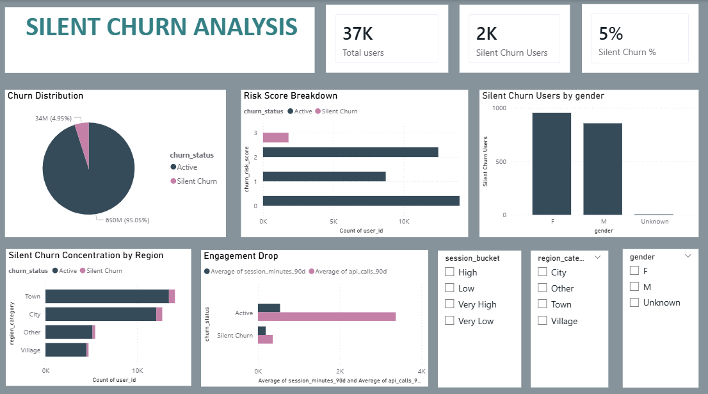

# Silent Churn Analysis

## Project Overview
Silent churn refers to users who gradually disengage from a product without formally exiting or cancelling their accounts. These users often go unnoticed but represent a significant retention risk.

This project focuses on identifying silently churning users using behavioral and engagement metrics, segmenting them by churn risk, and presenting actionable insights through an interactive Power BI dashboard.

## Objectives
- Identify silent churn based on inactivity and engagement patterns  
- Segment customers into churn risk levels for prioritization  
- Analyze engagement drop between active and silently churning users  
- Build a decision-oriented dashboard for business stakeholders  

## Tools and Technologies
- **PostgreSQL** – Data storage, transformation, and churn classification logic  
- **Python (Pandas, SQLAlchemy)** – Data enrichment, percentile bucketing, and risk scoring  
- **Power BI** – Interactive dashboard and data visualization  

## Dataset Description
The dataset contains user-level engagement and demographic attributes, including:
- Session minutes in the last 90 days  
- API calls in the last 90 days  
- Days since last activity  
- Age, gender, and region category  

The data was cleaned and reduced to analytically relevant features prior to analysis.

## Methodology
1. Cleaned and structured the dataset in PostgreSQL  
2. Defined silent churn logic using inactivity thresholds and median-based engagement benchmarks  
3. Created reusable SQL views for churn classification  
4. Connected PostgreSQL to Python using SQLAlchemy  
5. Enriched data with percentile-based engagement buckets using `qcut`  
6. Assigned churn risk scores to prioritize users for retention  
7. Designed an interactive Power BI dashboard for insight delivery  

## Key Insights
- Approximately **5% of users exhibit silent churn behavior** despite remaining active  
- **High-risk users (risk score 2–3)** form a small but critical segment requiring immediate attention  
- Silent churn users show **significantly lower engagement** across all metrics  
- **Town and City regions** contribute the highest volume of silent churn  

## Dashboard Overview
The Power BI dashboard provides:
- Overall user base and silent churn KPIs  
- Risk-based user prioritization  
- Engagement comparison between active and silent churn users  
- Region-wise churn concentration  
- Interactive filters for deeper exploration  

## Business Value
This analysis enables product and growth teams to:
- Detect disengagement early  
- Focus retention efforts on high-risk users  
- Improve engagement strategies using data-driven insights

